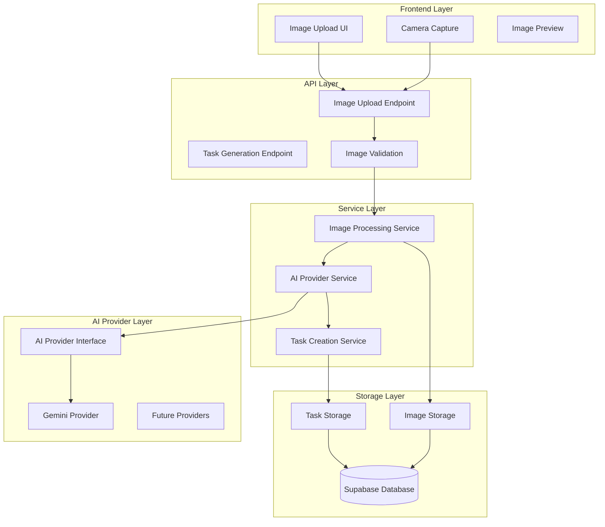

# Design Document

## Overview

The AI Image Task Generation feature enables users to upload or capture images and automatically generate relevant home maintenance tasks using AI vision models. The system will analyze images to identify maintenance needs and create prioritized tasks that integrate seamlessly with the existing task management system.

This feature serves as the foundation for multiple AI-powered capabilities, requiring a flexible, provider-agnostic architecture that supports rapid experimentation and easy provider switching. The initial implementation will use Google Gemini models but maintain abstraction layers for future provider additions.

### Technology Stack

#### AI/ML Libraries
- **Google Generative AI SDK** - For Gemini integration and vision model access
- **Pillow (PIL)** - Image processing, validation, compression, and format conversion

#### Backend Dependencies
- **FastAPI** - API endpoints and file upload handling
- **Pydantic** - Data validation and serialization
- **Supabase** - Database and storage integration
- **python-multipart** - Multipart form data handling for image uploads

#### Frontend Dependencies
- **React** - UI components for image upload and camera capture
- **Next.js** - Framework and API integration
- **TypeScript** - Type safety for API contracts

## Architecture

### High-Level Architecture



### Component Architecture

The system follows a layered architecture with clear separation of concerns:

1. **API Layer**: FastAPI endpoints for image upload and processing
2. **Service Layer**: Business logic for image processing, AI integration, and task creation
3. **Provider Layer**: Abstracted AI provider implementations
4. **Storage Layer**: Image and task persistence

## Components and Interfaces

### 1. Image Analysis API

**Endpoint**: `POST /api/analyze-image`

```python
class ImageAnalysisRequest(BaseModel):
    image: UploadFile  # Multipart form data
    generate_tasks: bool = True
    prompt_override: Optional[str] = None  # For testing

class GeneratedTask(BaseModel):
    title: str
    description: str
    priority: TaskPriority
    category: str
    confidence_score: float

class ImageAnalysisResponse(BaseModel):
    image_id: str
    tasks: List[GeneratedTask]
    image_analysis: str
    processing_time: float
    provider_used: str
    image_metadata: Dict[str, Any]  # size, format, etc.
```

**Responsibilities**:
- Accept image uploads (JPEG, PNG, WebP)
- Validate and preprocess images (size, format, compression)
- Analyze image with AI provider
- Generate and create tasks
- Store image and analysis results
- Return complete analysis results

### 3. AI Provider Interface

```python
from abc import ABC, abstractmethod
from typing import List, Dict, Any

class AIProvider(ABC):
    @abstractmethod
    async def analyze_image(self, image_data: bytes, prompt: str) -> Dict[str, Any]:
        """Analyze image and return structured response"""
        pass
    
    @abstractmethod
    def get_provider_name(self) -> str:
        """Return provider identifier"""
        pass
    
    @abstractmethod
    def get_usage_metrics(self) -> Dict[str, Any]:
        """Return usage statistics"""
        pass

class GeminiProvider(AIProvider):
    def __init__(self, api_key: str, model: str = "gemini-1.5-flash"):
        self.api_key = api_key
        self.model = model
        self.client = genai.GenerativeModel(model)
    
    async def analyze_image(self, image_data: bytes, prompt: str) -> Dict[str, Any]:
        # Implementation for Gemini API calls
        pass
```

### 4. Image Processing Service

```python
class ImageProcessingService:
    def __init__(self, ai_provider: AIProvider, storage_service: StorageService):
        self.ai_provider = ai_provider
        self.storage_service = storage_service
    
    async def analyze_image_and_generate_tasks(
        self, 
        image_data: bytes, 
        user_id: str,
        generate_tasks: bool = True
    ) -> ImageAnalysisResponse:
        """Main orchestration method for complete image analysis"""
        pass
    
    async def validate_and_preprocess_image(self, image_data: bytes) -> Tuple[bytes, Dict[str, Any]]:
        """Validate image format, size, and compress if needed to reduce AI costs"""
        pass
    
    def generate_prompt(self, context: Dict[str, Any]) -> str:
        """Generate AI prompt based on context and requirements"""
        pass
    
    def compress_image_for_ai(self, image_data: bytes, max_size_kb: int = 500) -> bytes:
        """Compress image to reduce AI processing costs while maintaining quality"""
        pass
```

### 5. Task Integration Service

```python
class TaskIntegrationService:
    def __init__(self, task_repository: TaskRepository):
        self.task_repository = task_repository
    
    async def create_tasks_from_ai_response(
        self, 
        ai_response: Dict[str, Any], 
        user_id: str, 
        image_id: str
    ) -> List[Task]:
        """Convert AI response to task objects and persist them"""
        pass
    
    def prioritize_tasks(self, tasks: List[GeneratedTask]) -> List[GeneratedTask]:
        """Apply business logic for task prioritization"""
        pass
```

## Data Models

### Extended Task Model

```python
class TaskSource(str, Enum):
    MANUAL = "manual"
    AI_GENERATED = "ai_generated"

class TaskCreate(TaskBase):
    source: TaskSource = TaskSource.MANUAL
    source_image_id: Optional[str] = None
    ai_confidence: Optional[float] = None
    ai_provider: Optional[str] = None

class Task(TaskBase):
    # ... existing fields
    source: TaskSource
    source_image_id: Optional[str]
    ai_confidence: Optional[float]
    ai_provider: Optional[str]
```

### New Image Model

```python
class ImageRecord(BaseModel):
    id: str
    user_id: str
    filename: str
    content_type: str
    file_size: int
    storage_path: str
    analysis_status: str  # pending, processing, completed, failed
    analysis_result: Optional[Dict[str, Any]]
    created_at: datetime
    processed_at: Optional[datetime]

class ImageAnalysis(BaseModel):
    image_id: str
    provider: str
    prompt_used: str
    raw_response: Dict[str, Any]
    generated_tasks: List[GeneratedTask]
    processing_time: float
    tokens_used: Optional[int]
    cost_estimate: Optional[float]
    created_at: datetime
```

### Database Schema Extensions

```sql
-- Images table
CREATE TABLE IF NOT EXISTS images (
    id UUID PRIMARY KEY DEFAULT gen_random_uuid(),
    user_id UUID NOT NULL REFERENCES users(id) ON DELETE CASCADE,
    filename TEXT NOT NULL,
    content_type TEXT NOT NULL,
    file_size INTEGER NOT NULL,
    storage_path TEXT NOT NULL,
    analysis_status TEXT DEFAULT 'pending' CHECK (analysis_status IN ('pending', 'processing', 'completed', 'failed')),
    analysis_result JSONB,
    created_at TIMESTAMP WITH TIME ZONE DEFAULT NOW(),
    processed_at TIMESTAMP WITH TIME ZONE
);

-- Image analysis logs
CREATE TABLE IF NOT EXISTS image_analyses (
    id UUID PRIMARY KEY DEFAULT gen_random_uuid(),
    image_id UUID NOT NULL REFERENCES images(id) ON DELETE CASCADE,
    provider TEXT NOT NULL,
    prompt_used TEXT NOT NULL,
    raw_response JSONB NOT NULL,
    processing_time FLOAT NOT NULL,
    tokens_used INTEGER,
    cost_estimate DECIMAL(10,4),
    created_at TIMESTAMP WITH TIME ZONE DEFAULT NOW()
);

-- Extend tasks table
ALTER TABLE tasks ADD COLUMN source TEXT DEFAULT 'manual' CHECK (source IN ('manual', 'ai_generated'));
ALTER TABLE tasks ADD COLUMN source_image_id UUID REFERENCES images(id) ON DELETE SET NULL;
ALTER TABLE tasks ADD COLUMN ai_confidence FLOAT;
ALTER TABLE tasks ADD COLUMN ai_provider TEXT;

-- Indexes
CREATE INDEX IF NOT EXISTS idx_images_user_id ON images(user_id);
CREATE INDEX IF NOT EXISTS idx_images_analysis_status ON images(analysis_status);
CREATE INDEX IF NOT EXISTS idx_image_analyses_image_id ON image_analyses(image_id);
CREATE INDEX IF NOT EXISTS idx_tasks_source ON tasks(source);
CREATE INDEX IF NOT EXISTS idx_tasks_source_image_id ON tasks(source_image_id);
```

## Error Handling

### Error Types and Responses

```python
class AIImageError(Exception):
    """Base exception for AI image processing"""
    pass

class ImageValidationError(AIImageError):
    """Image format or size validation failed"""
    pass

class AIProviderError(AIImageError):
    """AI provider API error"""
    pass

class TaskCreationError(AIImageError):
    """Error creating tasks from AI response"""
    pass

# Error response format
class ErrorResponse(BaseModel):
    error_code: str
    message: str
    details: Optional[Dict[str, Any]] = None
    retry_after: Optional[int] = None
```

### Error Handling Strategy

1. **Image Validation Errors**: Return 400 with specific validation messages
2. **AI Provider Errors**: Return 503 with retry information for temporary failures
3. **Rate Limiting**: Return 429 with retry-after headers
4. **Storage Errors**: Return 500 with generic error message (log details internally)
5. **Task Creation Errors**: Return 422 with validation details

## Testing Strategy

### 1. Unit Testing

**Image Processing Service Tests**:
- Image validation logic
- Prompt generation
- AI response parsing
- Task creation logic

**AI Provider Tests**:
- Mock provider responses
- Error handling scenarios
- Usage metrics tracking

**API Endpoint Tests**:
- Request validation
- Response formatting
- Error scenarios

### 2. Integration Testing

**End-to-End Image Processing**:
- Upload → Analysis → Task Creation flow
- Database persistence verification
- Storage integration

**AI Provider Integration**:
- Real API calls with test images
- Response parsing and validation
- Cost and usage tracking

### 3. Testing Infrastructure

**Test Image Library**:
```python
class TestImageLibrary:
    @staticmethod
    def get_bathroom_sink_image() -> bytes:
        """Returns test image of bathroom sink with limescale"""
        pass
    
    @staticmethod
    def get_lawn_image() -> bytes:
        """Returns test image of overgrown lawn"""
        pass
    
    @staticmethod
    def get_dishwasher_image() -> bytes:
        """Returns test image of dishwasher"""
        pass
```

**Prompt Testing Framework**:
```python
class PromptTester:
    def __init__(self, provider: AIProvider):
        self.provider = provider
    
    async def test_prompt_variations(
        self, 
        image: bytes, 
        prompts: List[str]
    ) -> List[TestResult]:
        """Test multiple prompt variations against same image"""
        pass
    
    def compare_results(self, results: List[TestResult]) -> PromptComparison:
        """Compare and rank prompt effectiveness"""
        pass
```

### 4. Performance Testing

- Image upload and processing latency
- AI provider response times
- Database query performance
- Concurrent request handling

### 5. Manual Testing Scenarios

1. **Happy Path**: Upload clear images, verify accurate task generation
2. **Edge Cases**: Blurry images, unusual angles, multiple objects
3. **Error Cases**: Invalid formats, oversized files, network failures
4. **Mobile Testing**: Camera capture, different device orientations
5. **Provider Switching**: Verify seamless provider changes

## Implementation Notes

### Image Preprocessing and Validation

**Validation Steps**:
1. **Format Validation**: Ensure image is JPEG, PNG, or WebP
2. **Size Validation**: Check file size is under MAX_IMAGE_SIZE_MB (10MB default)
3. **Content Validation**: Basic image integrity check
4. **Dimension Validation**: Ensure minimum dimensions for meaningful analysis

**Preprocessing for Cost Optimization**:
1. **Compression**: Reduce image size to MAX_AI_IMAGE_SIZE_KB (500KB default) while maintaining visual quality
2. **Format Optimization**: Convert to JPEG if not already for better compression
3. **Dimension Optimization**: Resize to optimal dimensions for AI analysis (e.g., max 1024x1024)
4. **Quality Adjustment**: Use configurable compression quality (85% default)

```python
class ImagePreprocessor:
    def __init__(self, config: AIConfig):
        self.config = config
    
    async def validate_and_preprocess(self, image_data: bytes) -> Tuple[bytes, Dict[str, Any]]:
        """Validate and preprocess image for AI analysis"""
        # Validation
        original_size = len(image_data)
        if original_size > self.config.MAX_IMAGE_SIZE_MB * 1024 * 1024:
            raise ImageValidationError("Image too large")
        
        # Load and validate image
        try:
            image = Image.open(BytesIO(image_data))
            format_type = image.format.lower()
            if f"image/{format_type}" not in self.config.SUPPORTED_FORMATS:
                raise ImageValidationError(f"Unsupported format: {format_type}")
        except Exception as e:
            raise ImageValidationError(f"Invalid image file: {str(e)}")
        
        # Preprocess for AI
        processed_data = self._compress_for_ai(image)
        
        metadata = {
            "original_size": original_size,
            "processed_size": len(processed_data),
            "original_format": format_type,
            "dimensions": image.size,
            "compression_ratio": len(processed_data) / original_size
        }
        
        return processed_data, metadata
    
    def _compress_for_ai(self, image: Image) -> bytes:
        """Compress image for AI processing while maintaining quality"""
        # Resize if too large
        max_dimension = 1024
        if max(image.size) > max_dimension:
            image.thumbnail((max_dimension, max_dimension), Image.Resampling.LANCZOS)
        
        # Convert to RGB if necessary
        if image.mode in ('RGBA', 'P'):
            image = image.convert('RGB')
        
        # Compress to target size
        output = BytesIO()
        quality = self.config.IMAGE_COMPRESSION_QUALITY
        
        while quality > 20:  # Don't go below 20% quality
            output.seek(0)
            output.truncate()
            image.save(output, format='JPEG', quality=quality, optimize=True)
            
            if len(output.getvalue()) <= self.config.MAX_AI_IMAGE_SIZE_KB * 1024:
                break
            quality -= 10
        
        return output.getvalue()
```

### AI Prompt Engineering

**Base Prompt Template**:
```
You are a home maintenance expert analyzing an image to identify maintenance tasks.

Analyze this image and identify specific, actionable home maintenance tasks based on what you observe.

For each task you identify:
1. Provide a clear, specific title (max 50 characters)
2. Include a detailed description explaining what needs to be done and why
3. Assign a priority level (high, medium, low) based on urgency and safety
4. Suggest a category (cleaning, repair, maintenance, safety, etc.)

Focus on:
- Visible maintenance needs (dirt, wear, damage)
- Safety concerns
- Preventive maintenance opportunities
- Seasonal considerations

Return your response as a JSON array of tasks with this structure:
{
  "tasks": [
    {
      "title": "Task title",
      "description": "Detailed description",
      "priority": "high|medium|low",
      "category": "category name",
      "reasoning": "Why this task is needed"
    }
  ],
  "analysis_summary": "Brief summary of what you observed in the image"
}

If you cannot identify any maintenance tasks, return an empty tasks array with an explanation in the analysis_summary.
```

### Configuration Management

```python
class AIConfig:
    GEMINI_API_KEY: str = Field(..., env="GEMINI_API_KEY")
    GEMINI_MODEL: str = Field("gemini-1.5-flash", env="GEMINI_MODEL")
    MAX_IMAGE_SIZE_MB: int = Field(10, env="MAX_IMAGE_SIZE_MB")
    MAX_AI_IMAGE_SIZE_KB: int = Field(500, env="MAX_AI_IMAGE_SIZE_KB")  # Compress for cost savings
    SUPPORTED_FORMATS: List[str] = Field(["image/jpeg", "image/png", "image/webp"])
    DEFAULT_PROVIDER: str = Field("gemini", env="DEFAULT_AI_PROVIDER")
    ENABLE_USAGE_TRACKING: bool = Field(True, env="ENABLE_AI_USAGE_TRACKING")
    IMAGE_COMPRESSION_QUALITY: int = Field(85, env="IMAGE_COMPRESSION_QUALITY")
```

### Monitoring and Observability

1. **Metrics to Track**:
   - Image processing success/failure rates
   - AI provider response times
   - Task generation accuracy (via user feedback)
   - Cost per image processed
   - Usage patterns by time/user

2. **Logging Strategy**:
   - Structured logging with correlation IDs
   - AI provider request/response logging (sanitized)
   - Performance metrics logging
   - Error tracking with context

3. **Health Checks**:
   - AI provider connectivity
   - Image storage accessibility
   - Database connectivity
   - Processing queue health