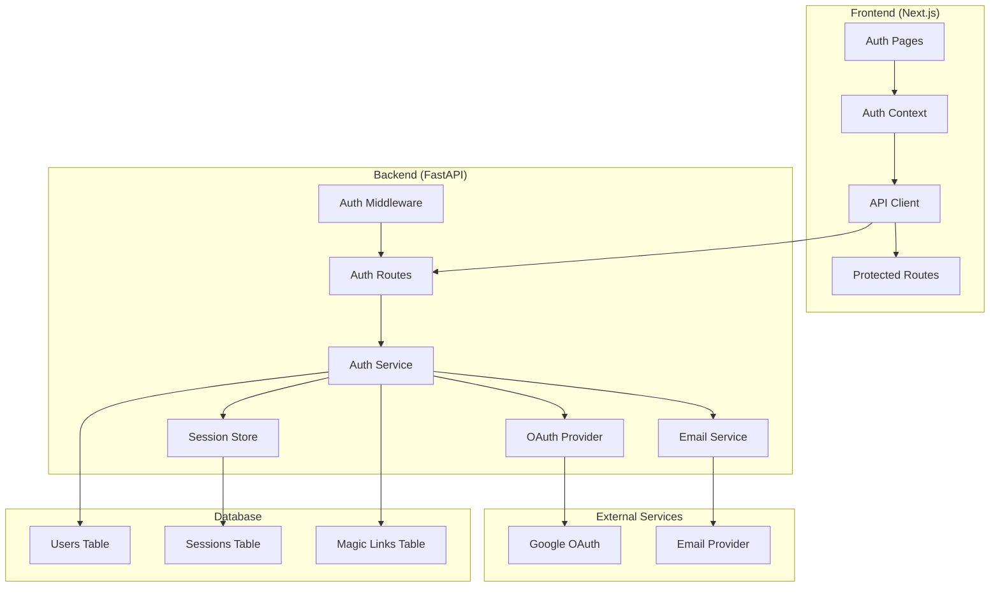

# Design Document

## Overview

This design implements a comprehensive authentication system for TodoHouse using industry-standard libraries and security practices. The system supports Google OAuth 2.0 and passwordless magic link authentication, with persistent sessions that work across multiple devices. The implementation leverages proven libraries to minimize custom authentication code and reduce security risks.

## Architecture

### High-Level Architecture



### Authentication Flow

#### Google OAuth Flow
1. User clicks "Sign in with Google"
2. Frontend redirects to backend OAuth initiation endpoint
3. Backend redirects to Google OAuth consent screen
4. User grants permission, Google redirects back to backend callback
5. Backend exchanges authorization code for tokens
6. Backend creates/updates user record and session
7. Backend redirects to frontend with session cookie
8. Frontend receives authenticated user state

#### Magic Link Flow
1. User enters email and clicks "Send Magic Link"
2. Frontend calls backend magic link endpoint
3. Backend generates secure token and stores in database
4. Backend sends email with magic link
5. User clicks link, which goes to backend verification endpoint
6. Backend validates token, creates session, redirects to frontend
7. Frontend receives authenticated user state

## Components and Interfaces

### Backend Components

#### Authentication Service (`app/auth/service.py`)
```python
class AuthService:
    async def create_magic_link(self, email: str) -> bool
    async def verify_magic_link(self, token: str) -> Optional[User]
    async def create_session(self, user: User) -> str
    async def get_user_from_session(self, session_token: str) -> Optional[User]
    async def revoke_session(self, session_token: str) -> bool
    async def cleanup_expired_tokens(self) -> int
```

#### OAuth Handler (`app/auth/oauth.py`)
```python
class GoogleOAuthHandler:
    async def get_authorization_url(self, state: str) -> str
    async def exchange_code_for_tokens(self, code: str, state: str) -> GoogleUserInfo
    async def get_user_info(self, access_token: str) -> GoogleUserInfo
```

#### Email Service (`app/auth/email.py`)
```python
class EmailService:
    async def send_magic_link(self, email: str, magic_link: str) -> bool
    async def send_welcome_email(self, user: User) -> bool
```

#### Rate Limiter (`app/auth/rate_limiter.py`)
```python
class RateLimiter:
    async def is_rate_limited_by_email(self, email: str) -> bool
    async def is_rate_limited_by_session(self, session_id: str) -> bool
    async def increment_email_counter(self, email: str) -> int
    async def increment_session_counter(self, session_id: str) -> int
```

### Frontend Components

#### Auth Context (`src/contexts/AuthContext.tsx`)
```typescript
interface AuthContextType {
  user: User | null;
  loading: boolean;
  signInWithGoogle: () => Promise<void>;
  sendMagicLink: (email: string) => Promise<void>;
  signOut: () => Promise<void>;
  refreshUser: () => Promise<void>;
}
```

#### Auth Pages
- `/auth/signin` - Sign in page with Google and magic link options
- `/auth/magic-link-sent` - Confirmation page after magic link sent
- `/auth/verify` - Magic link verification handler

#### Protected Route Wrapper (`src/components/ProtectedRoute.tsx`)
```typescript
interface ProtectedRouteProps {
  children: React.ReactNode;
  fallback?: React.ReactNode;
}
```

## Data Models

### Database Schema Updates

#### Users Table (Updated)
```sql
ALTER TABLE users ADD COLUMN IF NOT EXISTS google_id VARCHAR(255) UNIQUE;
ALTER TABLE users ADD COLUMN IF NOT EXISTS name VARCHAR(255);
ALTER TABLE users ADD COLUMN IF NOT EXISTS avatar_url VARCHAR(500);
ALTER TABLE users ADD COLUMN IF NOT EXISTS email_verified BOOLEAN DEFAULT FALSE;
```

#### Sessions Table (New)
```sql
CREATE TABLE sessions (
    id UUID PRIMARY KEY DEFAULT gen_random_uuid(),
    user_id UUID NOT NULL REFERENCES users(id) ON DELETE CASCADE,
    token VARCHAR(255) NOT NULL UNIQUE,
    expires_at TIMESTAMP WITH TIME ZONE,  -- NULL for persistent sessions
    created_at TIMESTAMP WITH TIME ZONE DEFAULT NOW(),
    last_used_at TIMESTAMP WITH TIME ZONE DEFAULT NOW(),
    user_agent TEXT,
    ip_address INET
);

CREATE INDEX idx_sessions_token ON sessions(token);
CREATE INDEX idx_sessions_user_id ON sessions(user_id);
CREATE INDEX idx_sessions_expires_at ON sessions(expires_at) WHERE expires_at IS NOT NULL;
```

#### Magic Links Table (New)
```sql
CREATE TABLE magic_links (
    id UUID PRIMARY KEY DEFAULT gen_random_uuid(),
    email VARCHAR(255) NOT NULL,
    token VARCHAR(255) NOT NULL UNIQUE,
    expires_at TIMESTAMP WITH TIME ZONE NOT NULL,
    used_at TIMESTAMP WITH TIME ZONE,
    created_at TIMESTAMP WITH TIME ZONE DEFAULT NOW()
);

CREATE INDEX idx_magic_links_token ON magic_links(token);
CREATE INDEX idx_magic_links_email ON magic_links(email);
CREATE INDEX idx_magic_links_expires_at ON magic_links(expires_at);
```

#### Rate Limiting Table (New)
```sql
CREATE TABLE rate_limits (
    id UUID PRIMARY KEY DEFAULT gen_random_uuid(),
    key VARCHAR(255) NOT NULL,
    count INTEGER NOT NULL DEFAULT 1,
    window_start TIMESTAMP WITH TIME ZONE NOT NULL,
    expires_at TIMESTAMP WITH TIME ZONE NOT NULL
);

CREATE INDEX idx_rate_limits_key ON rate_limits(key);
CREATE INDEX idx_rate_limits_expires_at ON rate_limits(expires_at);
```

### Pydantic Models

#### Authentication Models
```python
class GoogleUserInfo(BaseModel):
    id: str
    email: str
    name: str
    picture: Optional[str] = None
    email_verified: bool

class MagicLinkRequest(BaseModel):
    email: str = Field(..., regex=r'^[^@]+@[^@]+\.[^@]+$')

class AuthUser(BaseModel):
    id: uuid.UUID
    email: str
    name: Optional[str] = None
    avatar_url: Optional[str] = None
    email_verified: bool
    created_at: datetime
```

## Error Handling

### Authentication Errors
- `AUTH_001`: Invalid or expired session token
- `AUTH_002`: Invalid or expired magic link
- `AUTH_003`: Rate limit exceeded for magic link requests
- `AUTH_004`: OAuth state mismatch or invalid
- `AUTH_005`: Email sending failed
- `AUTH_006`: User account creation failed

### Error Response Format
```python
class AuthError(BaseModel):
    error_code: str
    message: str
    details: Optional[Dict[str, Any]] = None
    retry_after: Optional[int] = None  # For rate limiting
```

### Frontend Error Handling
- Display user-friendly error messages
- Automatic retry for transient errors
- Redirect to sign-in page for authentication errors
- Rate limiting feedback with countdown timer

## Testing Strategy

### Backend Testing

#### Unit Tests
- `test_auth_service_unit.py`: Test authentication service methods
- `test_oauth_handler_unit.py`: Test OAuth flow with mocked Google API
- `test_email_service_unit.py`: Test email sending with mocked provider
- `test_rate_limiter_unit.py`: Test rate limiting logic
- `test_auth_middleware_unit.py`: Test authentication middleware

#### Integration Tests
- `test_auth_flow_integration.py`: End-to-end authentication flows
- `test_magic_link_integration.py`: Magic link generation and verification
- `test_oauth_integration.py`: OAuth flow with test Google credentials
- `test_session_management_integration.py`: Session creation and validation

### Frontend Testing

#### Unit Tests
- `AuthContext.test.tsx`: Test authentication context state management
- `ProtectedRoute.test.tsx`: Test route protection logic
- `SignInPage.test.tsx`: Test sign-in form interactions

#### Integration Tests
- `auth-flow.test.tsx`: Test complete authentication flows
- `session-persistence.test.tsx`: Test session persistence across page reloads

## Security Considerations

### Session Security
- Cryptographically secure random session tokens (256-bit)
- HTTP-only cookies with Secure and SameSite attributes
- CSRF protection using double-submit cookie pattern
- Session token rotation on sensitive operations

### OAuth Security
- PKCE (Proof Key for Code Exchange) for authorization code flow
- State parameter validation to prevent CSRF attacks
- Secure redirect URI validation
- Token storage in secure HTTP-only cookies

### Magic Link Security
- Cryptographically secure random tokens (256-bit)
- Short expiration time (15 minutes)
- Single-use tokens (marked as used after verification)
- Dual rate limiting to prevent abuse:
  - 3 requests per email address per hour
  - 5 requests per session per hour (for anonymous users)

### General Security
- Input validation and sanitization
- SQL injection prevention through parameterized queries
- XSS prevention through proper output encoding
- Rate limiting on all authentication endpoints
- Audit logging for security events

## Implementation Libraries

### Backend Libraries
- **authlib**: OAuth 2.0 client implementation
- **python-jose**: JWT token handling (for OAuth tokens)
- **passlib**: Secure random token generation
- **httpx**: HTTP client for OAuth API calls
- **jinja2**: Email template rendering
- **slowapi**: Rate limiting middleware

### Frontend Libraries
- **@auth/core**: Authentication utilities
- **js-cookie**: Cookie management
- **react-query**: API state management and caching

### Email Service
- **resend**: Modern email API for magic link delivery
- **sendgrid**: Alternative email provider option
- **postmark**: Alternative email provider option

## Migration Strategy

### Data Migration
1. Add new columns to users table
2. Create new tables for sessions, magic_links, and rate_limits
3. Migrate existing header-based user sessions to authenticated sessions
4. Update all API endpoints to use authentication middleware

### Code Migration
1. Implement authentication backend services
2. Add authentication middleware to FastAPI
3. Update frontend with authentication context
4. Replace header-based user identification with session-based auth
5. Update all API calls to use session cookies instead of headers

### Rollback Plan
- Keep header-based authentication as fallback during transition
- Feature flag to enable/disable new authentication system
- Database rollback scripts for schema changes
- Monitoring and alerting for authentication failures

## Performance Considerations

### Session Storage
- In-memory cache (Redis) for frequently accessed sessions
- Database persistence for session durability
- Automatic cleanup of expired sessions and magic links

### Rate Limiting
- In-memory sliding window rate limiter with dual tracking:
  - Email-based rate limiting (3 requests per email per hour)
  - Session-based rate limiting (5 requests per session per hour)
- Distributed rate limiting for multi-instance deployments
- Efficient cleanup of expired rate limit entries

### OAuth Performance
- Cache Google OAuth configuration
- Connection pooling for external API calls
- Timeout configuration for OAuth requests

## Monitoring and Observability

### Metrics
- Authentication success/failure rates
- Magic link generation and verification rates
- Session creation and validation rates
- Rate limiting trigger rates
- OAuth flow completion rates

### Logging
- Authentication events (sign-in, sign-out, failures)
- Security events (rate limiting, suspicious activity)
- Performance metrics (response times, error rates)
- User migration events

### Alerts
- High authentication failure rates
- Email delivery failures
- OAuth provider downtime
- Unusual rate limiting patterns